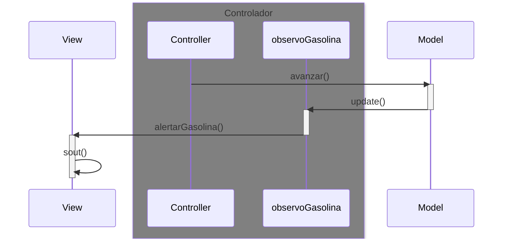
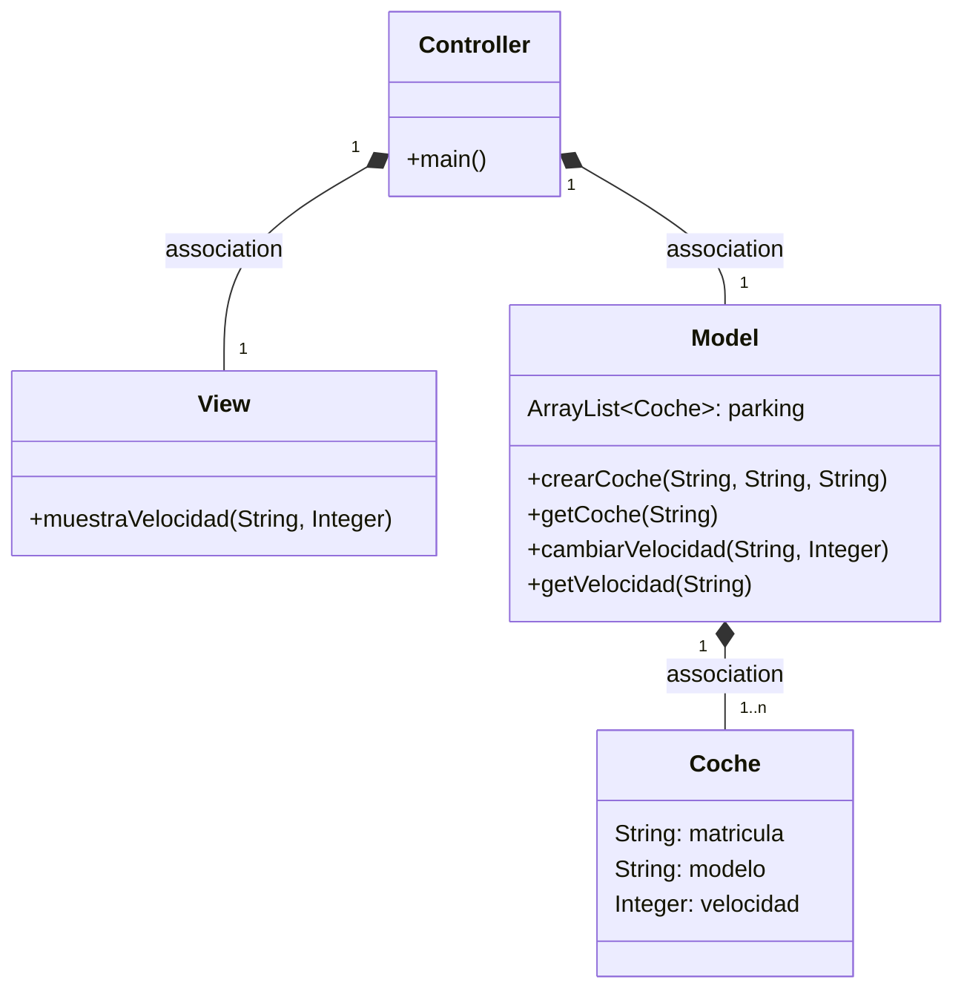
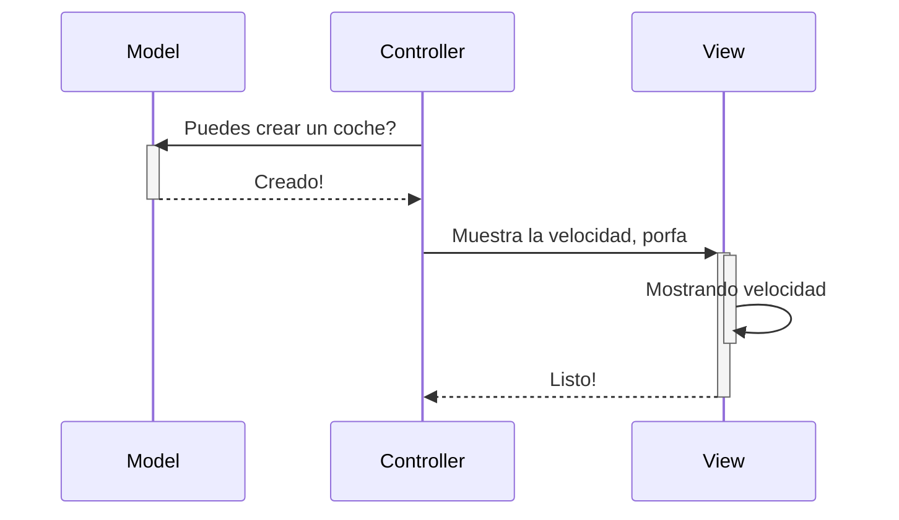
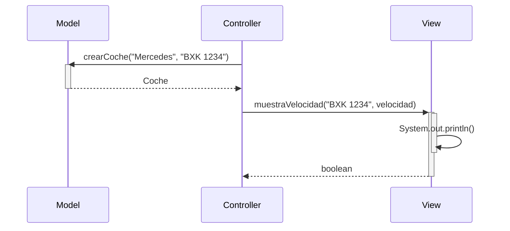
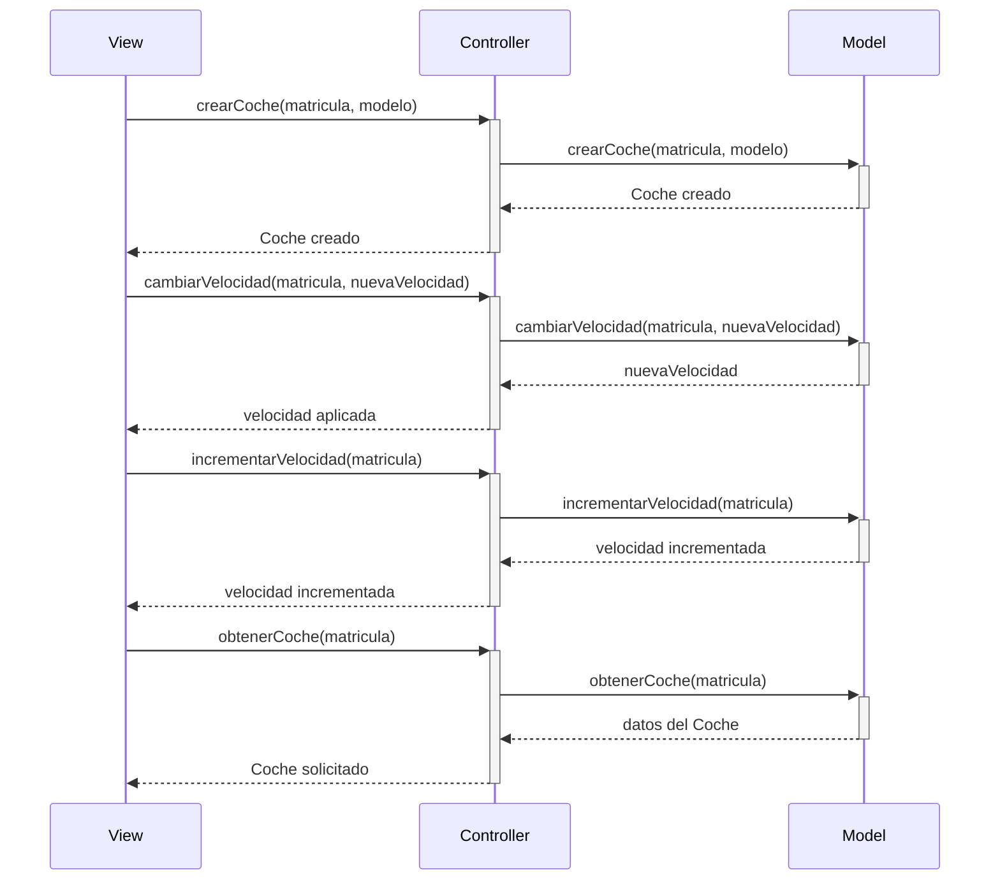

# Arquitectura MVC

Aplicación que trabaja con objetos coches, modifica la velocidad y la muestra

## Cambios que decidi hacer

Los cambios que decidi hacer y que luego me di cuenta son:

1. Retorno de la funcion avanzar en el model hago que retorne los metros que avanzo, al llamar a la funcion y no los metros totales que avanzo más los actuales
2. Se me olvido en avanzar poner lo de quitar gasolina en el pseudocodigo y en el diagrama de secuencia solo represente procesos pero no lo especifique asi que bueno, lo hare que en funcion de la velocidad y asi haga la resta pero si da menos que 0 lo pongo a 0
basicamente la formula que he sacado es algo asi, he cambiado la forma en la que hace el calculo para asegurar que funcione y hacerlo más sencillo, este es el actual calculo de gasolina
```java
coche.cantidadGasolina -= (metrosAvanzar+coche.velocidad)/2;
```
3. Tambien aunque seria más ortodoxo el uso de Interfaces como Observable y Observer que describiste en la rama Observer de tu repositorio de solucion de MVC, dado a que facilita la implementacion de multiples Observer, pues como tal yo no he hecho eso porque es más complejo y no es necesario para esto, aunque a lo mejor lo hago

---
## DIagrama con Observer de gasolina

## Diagrama de clases:



---

## Diagrama de Secuencia

Ejemplo básico del procedimiento, sin utilizar los nombres de los métodos




El mismo diagrama con los nombres de los métodos


Diagrama de secuencia propio, hecho en Mermaid
